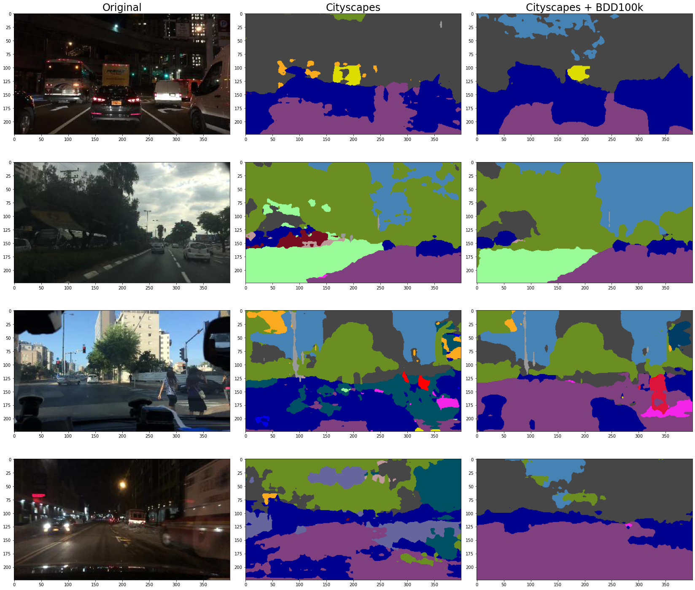
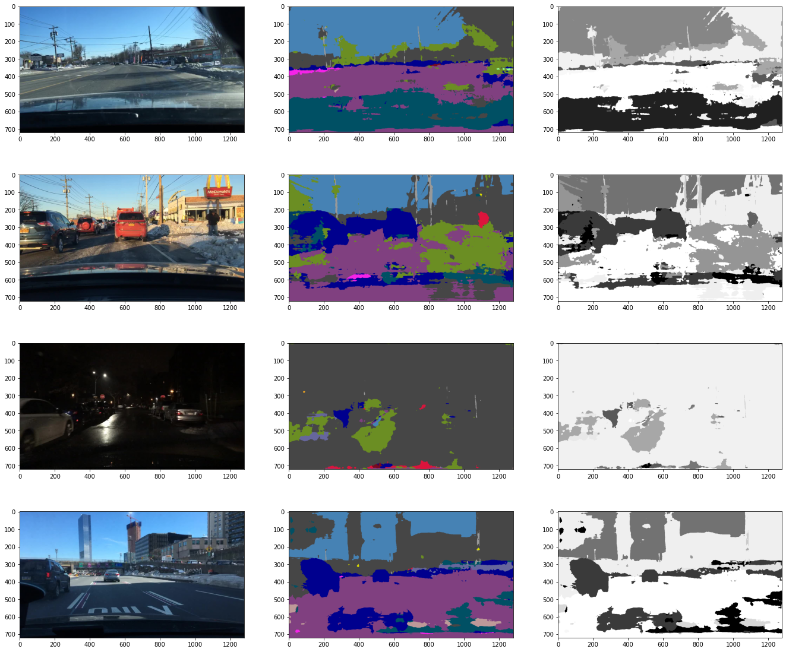

# DeepLearning2021
The problem of benchmarking and comparing different vision algorithms for autonomous driving tasks under different weather is fundamental in order to be able to deploy autonomous driving systems safely onto the road. However, collect large amount of data from different weather can be very difficult.

In our project, we proposed a new GAN network for transforming the weather of the images, in the hopes to generate new data for self driving without the need to collect more data.

## Packages
The packages used can be found in
````
requirements.txt
````

## Models
For the project, we experimented with two models: Proposed model, CycleGAN.
### Proposed Model
The propsed GAN model is located in the `network` folder.

To train the model, the user has to first set the path to the image dataset and segmentation maps of the images in `config.yaml`, and set image shape in `network/train.py`, then run
````
python network/train.py
````

The import path for various file might need to be changed based on the system.

### CycleGAN
The CycleGAN implementation can be found in the CycleGAN folder.

To train the model, the user has to set the path to the image dataset and image shape within `CycleGAN/train.py`, then run
````
python CycleGAN/train.py
````

## Logging
The losses and the generated image are logged with comet.ml, the user can replace the Experiment info in `train.py` files to perform logging.

## Dataset
For the dataset we use a a diving dataset `BDD100k`, the official website can found at
````
https://www.bdd100k.com/
````
The Processed dataset can found at the following links:

BDD100K 320x180 resolution
````
https://polybox.ethz.ch/index.php/s/7jeDd0aq7udXVKG
````
BDD100K 400x224 resolution
````
https://polybox.ethz.ch/index.php/s/88BbXwN0UeSA9fc
````
Segmentation maps 400x224 resolution
````
https://polybox.ethz.ch/index.php/s/NWZS0DM7kOIDXcQ
````

## Semantic segmentation

### Pretrained models
- Deeplabv3+ with mobilenet backbone, trained on cityscapes, 19 classes: [Link to model](https://www.dropbox.com/sh/w3z9z8lqpi8b2w7/AAB0vkl4F5vy6HdIhmRCTKHSa?dl=0&preview=best_deeplabv3plus_mobilenet_cityscapes_os16.pth)
- Deeplabv3+ with mobilenet backbone, trained on Cityscapes + 8k images of BDD100k, 19 classes: [Link to model](https://polybox.ethz.ch/index.php/s/vz0Mt7koxq5m5Ji)

### Semantic map dataset
- Results from Cityscapes model: [Link to dataset](https://polybox.ethz.ch/index.php/s/UHc5ScYh8yix60v)
- Results from Cityscapes+BDD100k model: [Link to dataset](https://polybox.ethz.ch/index.php/s/2OiiqopV6arPaG2)
- Comparison of results:


### Dataset structure
```bash
seg_result/
|-- classids
|   |-- train
|   |   |-- clear (37344 images)
|   |   |-- overcast (8770 images)
|   |   `-- snowy (5549 images)
|   `-- val
|       |-- clear (5346 images)
|       |-- overcast (1239 images)
|       `-- snowy (769 images)
`-- colormaps
    |-- train
    |   |-- clear (37344 images)
    |   |-- overcast (8770 images)
    |   `-- snowy (5549 images)
    `-- val
        |-- clear (5346 images)
        |-- overcast (1239 images)
        `-- snowy (769 images)
```
In `classids`, each pixel of the png image is the class ID (from 0 to 18) of this pixel. In `colormaps`, each pixel has a 3 channel RGB value. The class definition can be found in `./segmentation/datasets/bdd100k.py`. The folowing picture shows the original image, colormaps and classids.



References:
- https://doc.bdd100k.com/format.html#seg-mask
- https://github.com/VainF/DeepLabV3Plus-Pytorch
