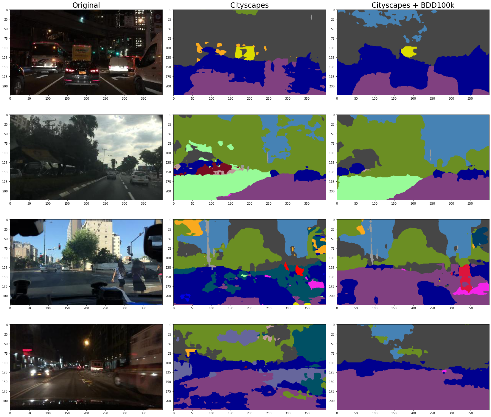

# Pretrained semantic segmentation models

## Models
- Deeplabv3+ with mobilenet backbone, trained on cityscapes, 19 classes: [Link to model](https://www.dropbox.com/sh/w3z9z8lqpi8b2w7/AAB0vkl4F5vy6HdIhmRCTKHSa?dl=0&preview=best_deeplabv3plus_mobilenet_cityscapes_os16.pth)
- Deeplabv3+ with mobilenet backbone, trained on Cityscapes + 8k images of BDD100k, 19 classes: [Link to model](https://polybox.ethz.ch/index.php/s/vz0Mt7koxq5m5Ji)

## Semantic map dataset
- Results from Cityscapes model: [Link to dataset](https://polybox.ethz.ch/index.php/s/UHc5ScYh8yix60v)
- Results from Cityscapes+BDD100k model: [Link to dataset](https://polybox.ethz.ch/index.php/s/2OiiqopV6arPaG2)
- Comparison of results:


### Dataset structure
```bash
seg_result/
|-- classids
|   |-- train
|   |   |-- clear (37344 images)
|   |   |-- overcast (8770 images)
|   |   `-- snowy (5549 images)
|   `-- val
|       |-- clear (5346 images)
|       |-- overcast (1239 images)
|       `-- snowy (769 images)
`-- colormaps
    |-- train
    |   |-- clear (37344 images)
    |   |-- overcast (8770 images)
    |   `-- snowy (5549 images)
    `-- val
        |-- clear (5346 images)
        |-- overcast (1239 images)
        `-- snowy (769 images)
```
In `classids`, each pixel of the png image is the class ID (from 0 to 18) of this pixel. In `colormaps`, each pixel has a 3 channel RGB value. The class definition can be found in `./segmentation/datasets/bdd100k.py`. The folowing picture shows the original image, colormaps and classids.


References:
- https://doc.bdd100k.com/format.html#seg-mask
- https://github.com/VainF/DeepLabV3Plus-Pytorch
